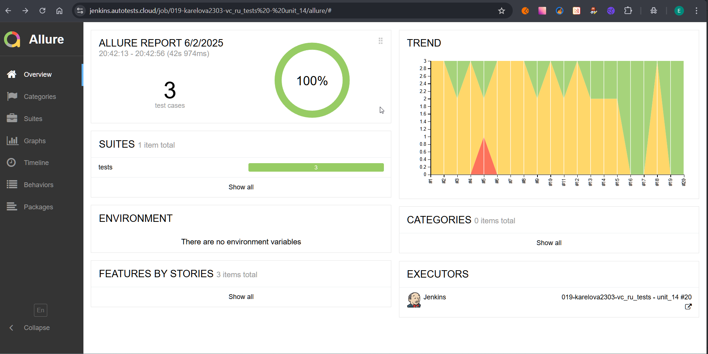

# Пример организации автотестирования для веб-сайта <a target="_blank" href="https://vc.ru/">Vc.ru</a>
> Vc.ru — Это крупнейшая в рунете платформа, где публикуются ключевые новости, мнения, обзоры и аналитика. 
> Материалы пишут и сотрудники редакции, и пользователи платформы.

## :open_book: Содержание:
- [Описание проекта](#heavy_check_mark-описание)
- [Кратко](#heavy_check_mark-кратко)
- [Технологии и инструменты](#gear-технологии-и-инструменты)
- Что проверяем:
  - [UI](#heavy_check_mark-реализованные-ui-проверки)
- Запуск тестов:
  - [Jenkins](#-запуск-тестов-из-jenkins)
  - [Локально](#computer-локальный-запуск)
- Отчеты:
  - [Allure](#bar_chart-отчеты-о-прохождении-тестов-доступны-в-allure)
  - [Telegram](#-telegram)
- [Allure TestOps](#briefcase-проект-интегрирован-с-allure-testops)
- [Видео прогона теста](#movie_camera-пример-видео-тестового-прогона)


## :heavy_check_mark: Описание
В проекте представлен пример UI автоматизации тестирования на Python. 
<p>При написании тестов использовался шаблон проектирования PageObjects.
<p>Выделены тест-кейсы.
<p>Подключена система отчетности Allure Reports с вложениями (логи, скриншоты, видео, etc). 
В тестах отображен тип передачи шагов теста в отчет:
 
- Лямбда-степы через with allure.step

<p>Также по факту прохождения теста отправляется уведомление с результатами в Telegram.
<p>Браузер в запускается удаленно в Selenoid.
<p>Реализована интеграция с Allure TestOps.

## :heavy_check_mark: Кратко
- [x] `Page Object` с шагами 
- [x] Запуск тестов, используя `Jenkins` и `Selenoid`
- [x] `Allure Reports` с вложениями (скриншоты, видео)
- [x] Интеграция с `Allure TestOps`
- [x] Отправка результатов тестирования в `Telegram`

## :gear: Технологии и инструменты:

<div align="center">
  &nbsp;
  &nbsp; 
  &nbsp;  
  &nbsp;
  &nbsp;  
  &nbsp;    
  &nbsp;
  &nbsp;
  &nbsp;
  &nbsp;
</div>

## :heavy_check_mark: Реализованные проверки

> - Отображения компонентов хедера при открытии страницы
> - Проверка боковой панели "Темы" при клике на вкладки:
>   - Название карточки и выбранной темы совпадают
>   - Никнейм карточки и выбранной темы совпадают
> - Проверка информационного раздела в боковой панели "vc.ru" 
>   - Проверка автора карточки в разделах "О проекте", "Правила", "Реклама"
>   - Проверка названия карточки разделов "О проекте", "Правила", "Реклама"
>   - Проверка текста модального окна в разделе "Приложения"
>   - Проверка отображения qr-кода в разделе "Приложения"


##  Запуск тестов из Jenkins

Для запуска тестов из Jenkins:
1. Открыть сборку в [Jenkins](https://jenkins.autotests.cloud/job/019-karelova2303-vc_ru_tests%20-%20unit_14/)
2. Кликнуть кнопку "Build with Parameters" в боковом меню

<p></p>

2. Выбрать параметры

<p></p>

3. Кликнуть кнопку "Build"

## :computer: Локальный запуск 

1. Склонировать репозиторий
2. Установить зависимости командой `pip install -r requirements.txt`
3. Открыть проект в PyCharm, установить интерпретатор
4. Создать `.env` файл, пример файла - `.env.example`, находится в корне проекта
5. Запустить тесты в командной строке:
```bash
pytest --browser_version={BROWSER_VERSION} 
```

### :heavy_plus_sign: Параметры сборки

> - BROWSER_VERSION — версия браузера _(chrome: 128.0, 127.0), по умолчанию 128.0

## :bar_chart: Отчеты о прохождении тестов доступны в Allure

Сформировать отчет можно:
-  локальный запуск: ввести в командной строке `allure serve allure-results`
-  запуск через Jenkins: кликнуть кнопку "Allure Report" в боковом меню 

<p></p>

###  Allure

#### Примеры отображения тестов

<p></p>


###  Telegram

Настроена отправка отчета в Telegram


## :briefcase: Проект интегрирован с Allure TestOps 

### [Ссылка на проект в TestOps](https://allure.autotests.cloud/project/4775/dashboards)
#### Cобраны тест-кейсы 


#### Представлены дашборды аналитики


## :movie_camera: Пример видео тестового прогона

В отчетах Allure для каждого теста прикрепленs скриншот, лог и видео прохождения теста

<p align="center">
  
</p>